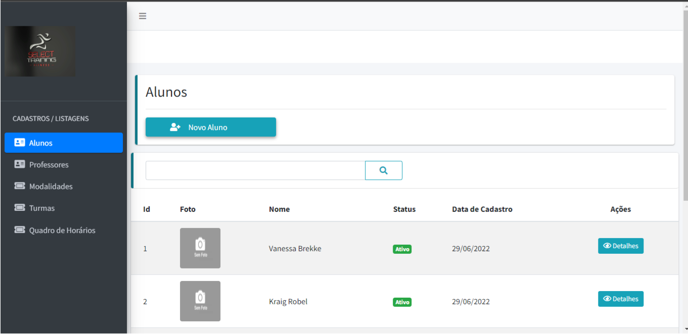
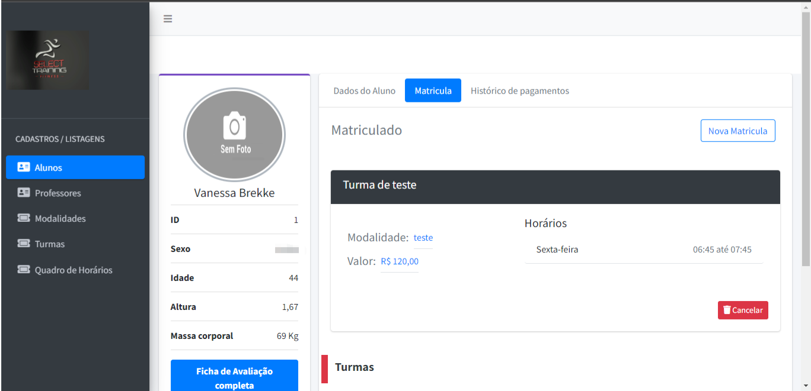
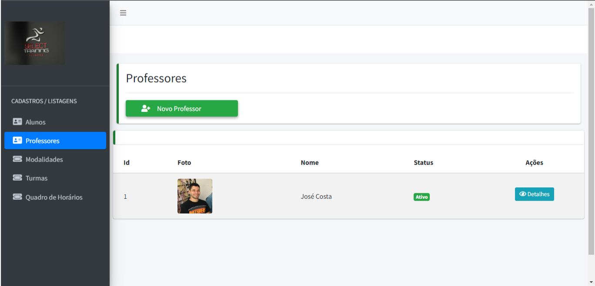
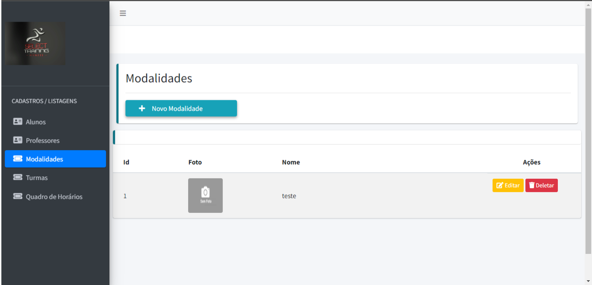
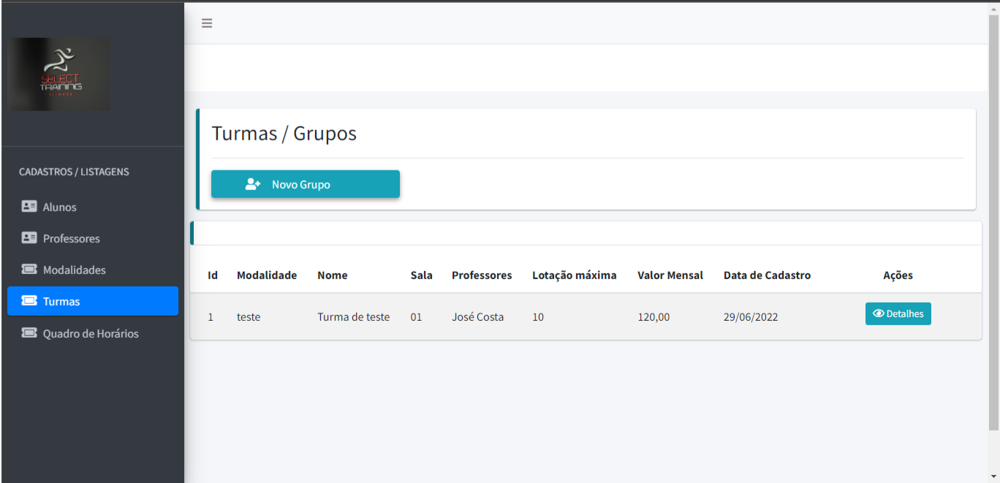
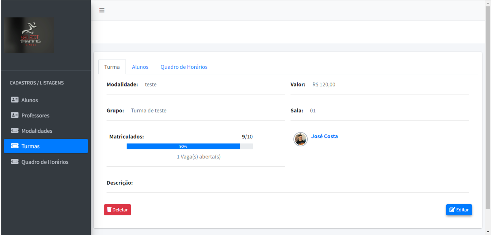
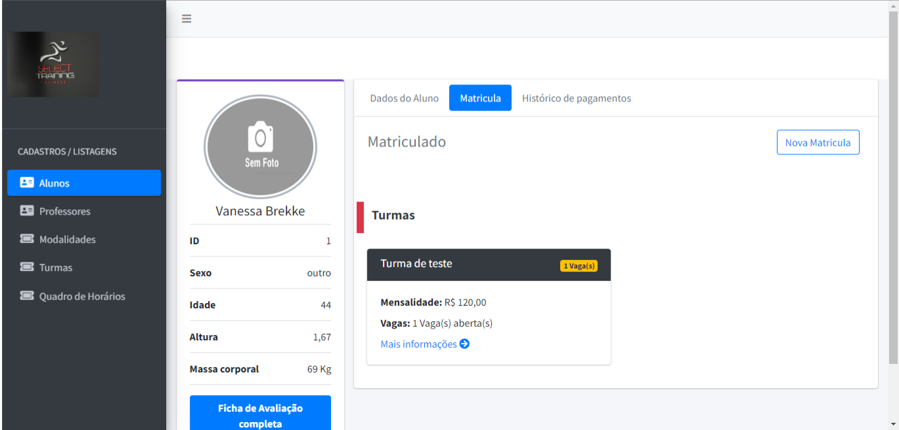

<p align="center">
  

  
  
  <a href="https://github.com/askagi/select-system/commits/master">
    
  </a>

   
   <a href="https://github.com/askagi/select-system/stargazers">
    
  </a>

</p>
<h1 align="center">
 Select System
</h1>

<p align="center">
 <a href="#-sobre-o-projeto">Sobre</a> •
 <a href="#-funcionalidades">Funcionalidades</a> •
 <a href="#-layout">Layout</a> •
 <a href="#-como-executar-o-projeto">Como executar</a> •
 <a href="#-tecnologias">Tecnologias</a> •
 <a href="#-autor">Autor</a> •
 <a href="#user-content--licença">Licença</a>
</p>

## 💻 Sobre o projeto

🏆 Select System - é um sistema para academias com a possibilidade de cadastrar e gerenciar alunos, professores, modalidades, turmas com a finalidade de  organizar de forma otimizada a relação entre as entidades envolvidas.

Projeto desenvolvido em 2020 como objeto de estudo/prática em Laravel.

---

## ⚙️ Funcionalidades

- [x] Alunos/Clientes:
  - [x] Listar
  - [x] Cadastrar
  - [x] Ver detalhes

- [x] Professores:
  - [x] Listar
  - [x] Cadastrar
  - [x] Editar
  - [x] Ver detalhes

- [x] Modalidades:
  - [x] Listar
  - [x] Cadastrar
  - [x] Editar
  - [x] Deletar

- [x] Turmas/Grupos:
  - [x] Listar
  - [x] Cadastrar
  - [x] Editar
  - [x] Ver detalhes

- [x] Quadro de horários:
  - [x] Listar
  - [x] Cadastrar
  - [x] Editar
  - [x] Ver detalhes

---

## 🎨 Layout

### Algumas telas

<div align="center" style="display: flex; align-items: flex-start; justify-content: center; flex-wrap: wrap; gap: 15px 0">
  
  
  
  
  
  
  
  
  
</div>

---

## 🚀 Como executar o projeto

### Pré-requisitos

Antes de começar, você vai precisar ter instalado em sua máquina as seguintes ferramentas:
[Git](https://git-scm.com), [PHP](https://www.php.net/) [Composer](https://getcomposer.org/)

Para termos sucesso na utilização do Laravel verique se seu PHP respeita as seguintes configurações:

• PHP maior ou igual ao 7.2;
• Extensão BCMath
• Extensão Ctype
• Extensão JSON
• Extensão Mbstring
• Extensão OpenSSL
• Extensão PDO
• Extensão Tokenizer
• Extensão XM

Além disto é bom ter um editor para trabalhar com o código como [VSCode](https://code.visualstudio.com/)

#### 🎲 Rodando o Backend (servidor)

```bash

# Clone este repositório
$ git clone git@github.com:askagi/select-system.git

# Acesse a pasta do projeto no terminal/cmd
$ cd select-system

# Instale as dependências
$ composer install

ou

$ composer update

# Monte as tabelas do banco de dados
$ composer migrate

# Execute a aplicação
$ php artisan serve


```

---

## 🛠 Tecnologias

As seguintes ferramentas foram usadas na construção do projeto:

- **[Laravel](https://laravel.com/)**
- **[AdminLTE](https://adminlte.io/)**
- **[AOS](https://michalsnik.github.io/aos/)**
- **[MySql](https://www.mysql.com/)**
- **[Eloquent ORM](https://laravel.com/docs/5.0/eloquent)**

---

## 🦸 Autor

<a href="https://github.com/askagi">
 
 <br />🎧
 <sub><b>José Costa</b></sub></a> <a href="https://www.linkedin.com/in/josecostasantosjr/" title="Linkedin"></a>
 <br />

[](https://www.linkedin.com/in/josecostasantosjr/)
[](mailto:josecostasantos.js@gmail.com)

---

## 📝 Licença

Este projeto esta sobe a licença [MIT](./LICENSE).

Feito com ❤️ por José Costa 👋🏽 [Entre em contato!](https://www.linkedin.com/in/josecostasantosjr/)
